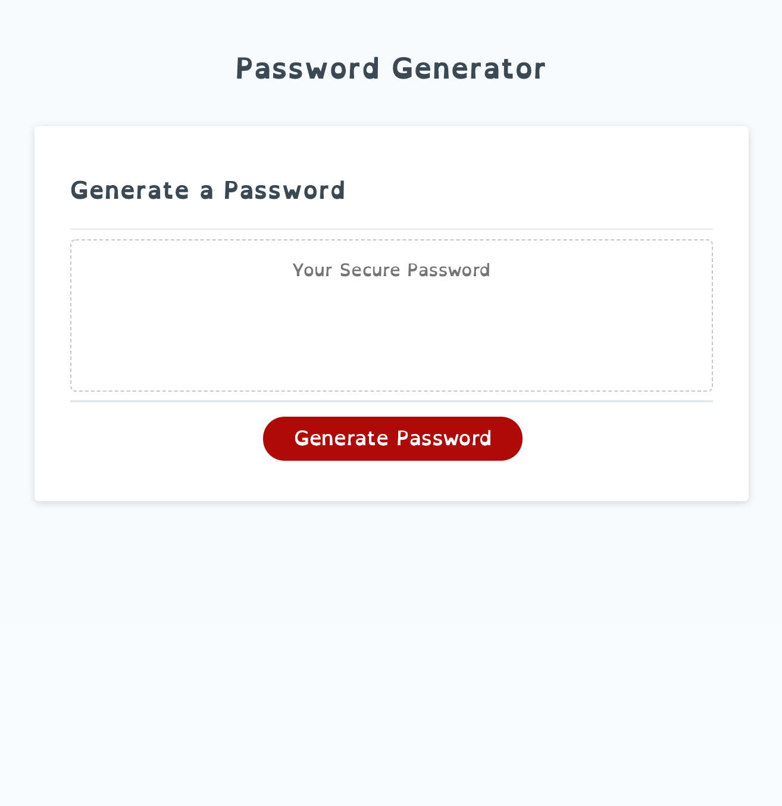

# password-generator

Built a password generator focusing on Javascript. The password generator was given specific rules about what characters and how many can be used to generate a password.

## Link to webpage.

[link:] (https://jj77847.github.io/password-generator/)

### Screenshot of website

## Functionality

1. User will click the button to generate a password
2. After clicking the user will be prompted with questions based upon the criteria abd the options for their unique password:

- The Criteria:
- Must be between 8 and 128 characters long
- Must choose at least 1 of the character options:

  - numbers
  - lower case letter
  - upper case letter
  - and/or special character

- The Options:
- User chooses length of password within the criteria
- User can choose all, some or none of the password character choices: (must include at least 1 option per criteria above)
  - numbers
  - lower case letter
  - upper case letter
  - special character

When the user has answering the prompts the password will generate and appear in the box.

## Link to webpage.

[link:] (https://jj77847.github.io/password-generator/)

### Screenshot of website

